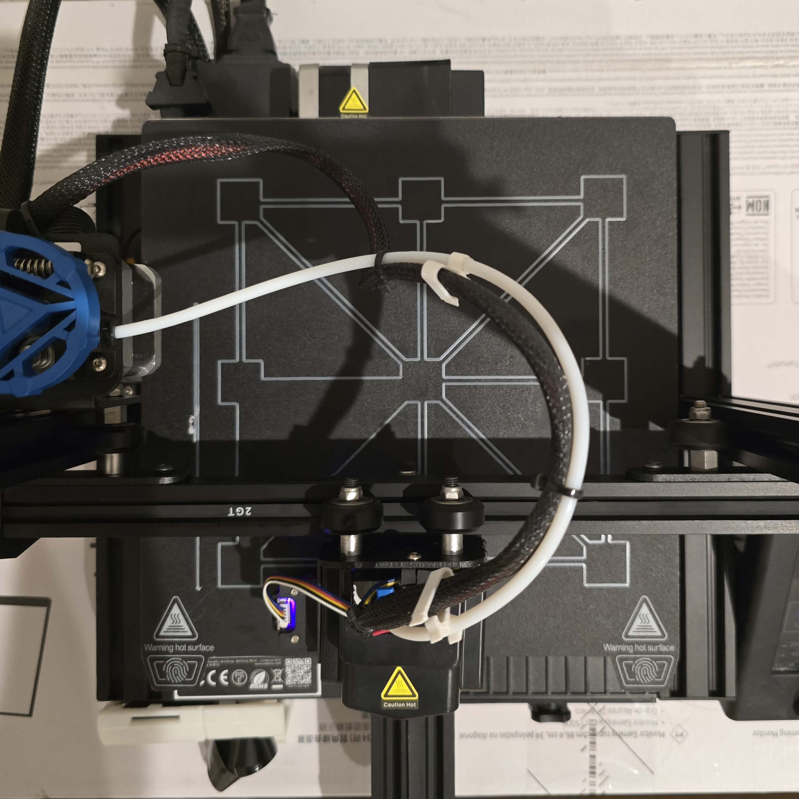
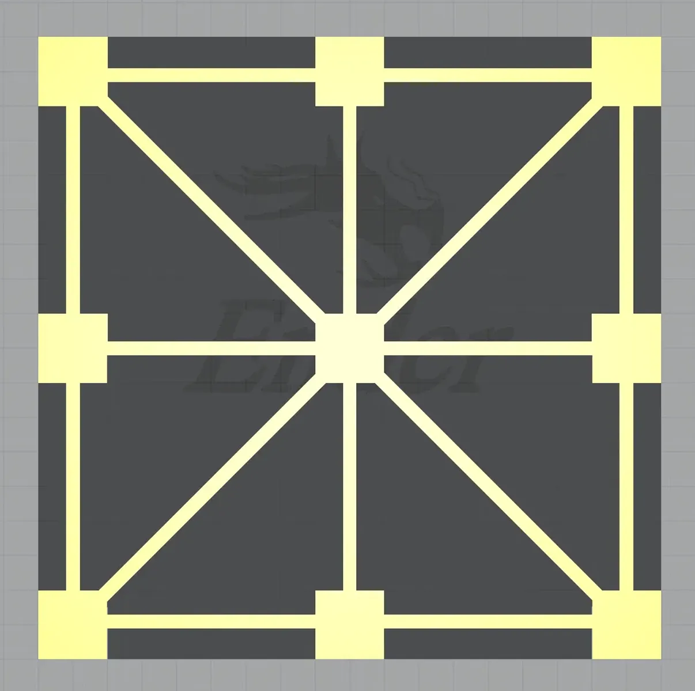
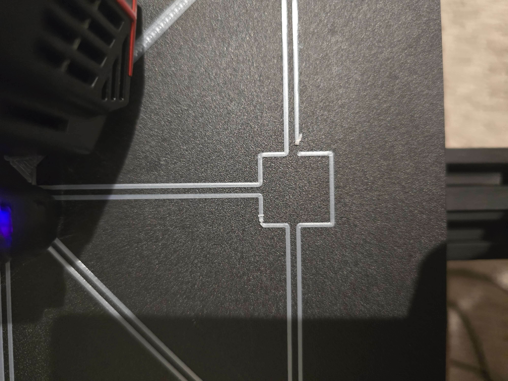
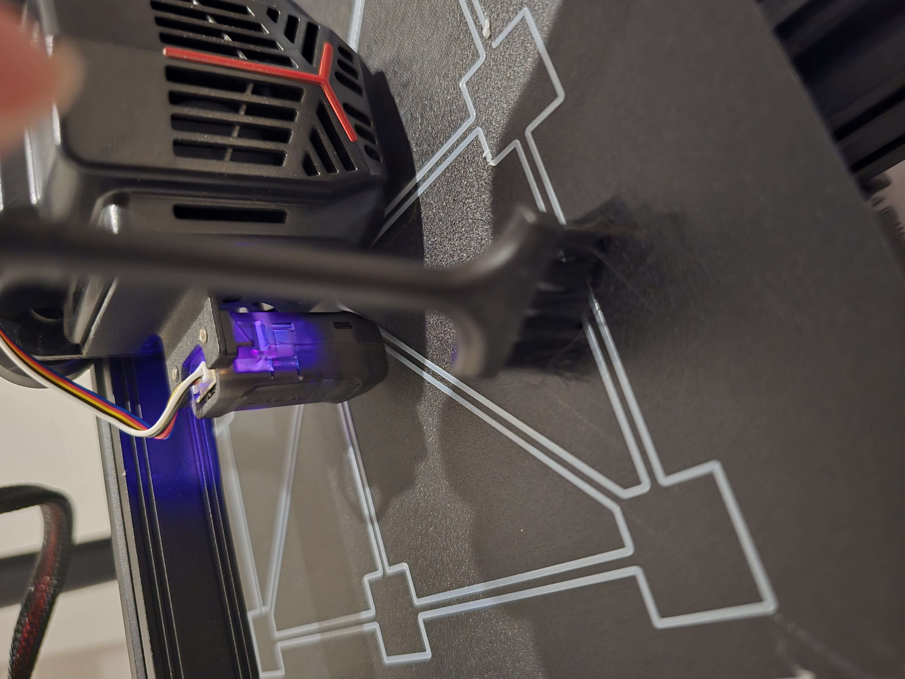
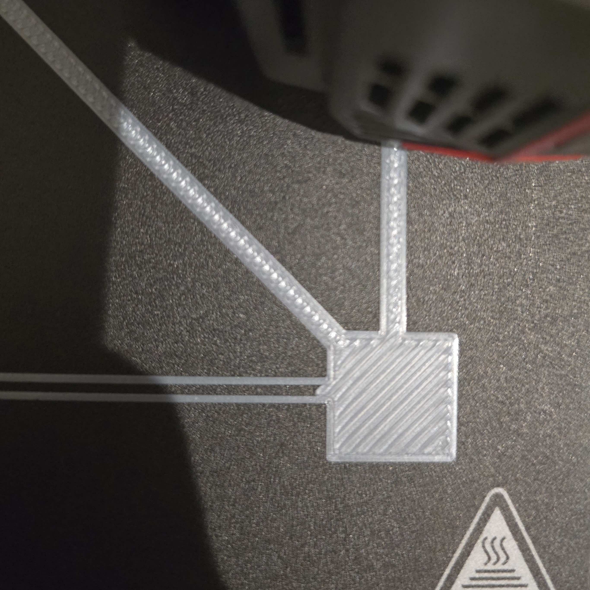

# 3D Print Reference

### Outline
- [Description](#description)
- [What This Reference Covers](#what-this-reference-covers)
- [How to Use This Reference](#how-to-use-this-reference)
- [Manual Adjustments](#manual-adjustments)

### Description

The purpose of this repository is to document my personal process for
setting up and configuring a 3D printer. These configurations apply
specifically for 'bedslinger' styles of printers. Core-xy have fundamental
differences and some aspects of this document may not apply. The printer
I will be using for example is the Creality Ender 3 V2 Neo, which I have
had and used for years. For other printers, principles from this doc may
apply.

I've decided to begin this project to assist myself and other enthusiasts
with a straightforward, procedure for quickly setting up popular
Ender-style 'bedslingers'. Many modern printers enjoy enhancements that
automate or minimize these manual and often frustrating procedures. Also,
many references already exist for these platforms so I will attempt to not
reinvent the wheel in this process. As I am still a proud owner of one of
these machines, finicky as they might be, I will continue to support their
configuration, customization and freedom as long as possible. Long live
the Ender!

Thanks for checking out this repository, and Happy printing.

## What This Reference Covers

This document will focus on the setup and manual adjustments that I have
found useful for Ender-style bedslingers. As the project grows, I plan to
include notes on the following:

* Basic first-time setup and mechanical checks
* Bed leveling and Z-offset adjustments
* First-layer testing and troubleshooting
* Useful models, upgrades, and configuration references

## How to Use This Reference

Start with the manual adjustments below before making software or hardware
changes. Once the first layer is consistent, use the linked test model to
confirm the settings. The recommendations here are based on my Ender 3 V2
Neo, so use them as a starting point and adjust them for your own machine.

## Manual Adjustments
These steps apply to **bedslinger** printers; CoreXY printers require a
different process.

### Manually Tram the Bed and Set the Z Offset

The bed-adjustment dials are used to manually tram the bed at each of its
four corners. The Z-offset setting itself is adjusted through the printer's
controls, if your printer uses one.

1. Heat the bed to your usual printing temperature. Heating the nozzle is
   optional. **Caution:** hot printer components can cause burns.
2. Auto-home the printer, then make sure the nozzle is clean before taking
   any measurements.
3. Use the printer controls to set the Z height to `0`.
4. Move the nozzle to a corner of the bed (for example, `X190 Y190`).
5. Place a `0.102 mm` feeler gauge—approximately the thickness of standard
   printer paper—between the nozzle and bed.
6. Adjust that corner with the bed-adjustment dial, rather than the printer
   controls, until the desired nozzle clearance is reached.
7. Repeat steps 4–6 for each remaining corner, then revisit all four corners
   once more. Adjusting one corner can affect the others.

If your printer supports bed meshing, keep the bed heated, auto-home, and run
the mesh now. Follow your printer's instructions to save or load the mesh.
Then set or verify the Z offset through the printer controls and run a
first-layer adhesion test print.

### Recommended Bed-Leveling Model

I use [this bed-leveling model by @Supertornado on
Printables](https://www.printables.com/model/144326). It provides a practical
first-layer adhesion test after completing the manual adjustments above.

Although simple, this model is very telling for the success rate of future
prints. Look for small failures as these often add up to much larger
inconsistencies with future larger, more complex prints.

> Note the inconsistent extrusion here

### Mechanical adhesion test

Using the recommended model above, one useful test
may be performed using a small nylon-bristled
brush. I prefer to perform this check as the test model
is actively printing.

This test is performed by sliding the bristles
with very minor tension over the first extruded layer of
the print in order to check for any inconsistent
bed adhesion. This may signify a low spot in the
bed's mechanical leveling, though it can also point to
an incorrect Z offset, flow issue, or a dirty bed. Keep
your fingers and brush clear of the hot nozzle and moving
axes, and stop the print before making any adjustments.

If all looks good thus far, you may allow the print
to complete.

One final recommendation is to look for proper spacing
between extrusions. Once again, you may use the nylon
brush or similar to inspect the adhesion between the
extruded plastic. Look for gaps or over-extrusion
that might signify the need for further tweaks to
Z offset or filament flow rate.
